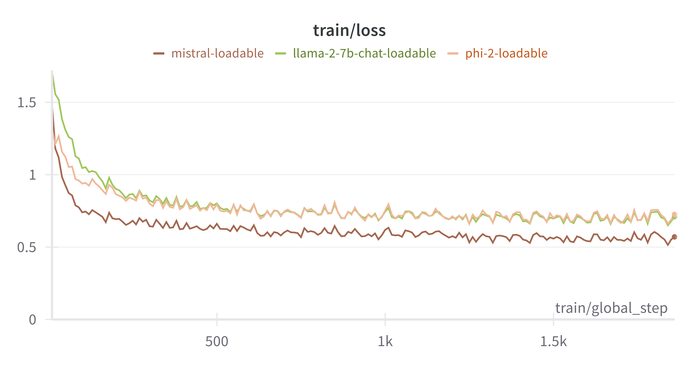
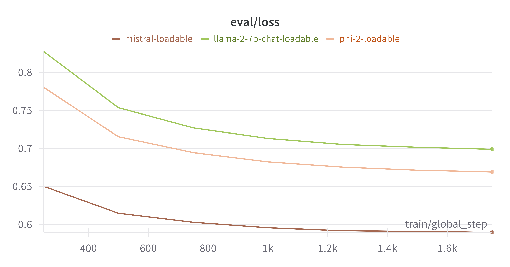

# LLM-FineTune
Repository for the Assignment 1.C for the NLP course.

## Usage

### Environment
You can install the required dependencies with the following command:
```bash
conda env create -f environment.yml
```

Then activate the environment:
```bash
conda activate torch-main
```

### Training

Everything in this project is controlled via hydra configurations. you can take a look at the default config by running this command:
```bash
python train.py --cfg job
```
each and every entry of the configuration you see is changable both through the config files and through command line arguments. you can change any value by simply typing its dot path and assign a new value. For example:
```bash
python train.py data.split_seed=2024 --cfg job
```
will print the same configuration as before with only the split_seed value changed.

to actually run the training, you can run:
```bash
accelerate launch --config_file accelerate_config.yaml train.py
```

you can change the model by creating a model configuration file or use one of the pre-created configs. For example, to use Mistral instead of Llama-2, run:
```bash
accelerate launch --config_file accelerate_config.yaml train.py +experiment=train-mistral
```

### Evaluation

Evaluation is alsp controlled through the same framework. to evaluate the model on some popular metrics that are defined in `conf/experiment/eval.yaml`, run:
```bash
accelerate launch --config_file accelerate_config.yaml eval.py +experiment=eval
```
This will use the default model, Llama-2, to generate responses and evaluate using the metrics, to change the model, run:
```bash
accelerate launch --config_file accelerate_config.yaml eval.py model=mistral +experiment=eval 
```

## Results
The LLama-2-7b-chat, Phi-2, and Mistral Models are fine-tuned on the python-codes data set using the default config (printable by `python train.py --cfg job`).


Train Loss             |  Eval Loss
:-------------------------:|:-------------------------:
  |  


Each fine-tuned model is then evaluated using the default metrics denoted in the `python eval.py +experiment=eval --cfg job`

Model      | BlEU Score | Rouge-L  | BERTScore | Human
| ------ | ------ | ------ | ------ | -- |
LLaMA2 7B  | 0.0905     | 0.62821      | 0.80228   | 0.89
Mistral    | 0.08834    | 0.63366      | 0.79927   |0.86
Phi2       | 0.06535    | 0.63741      | 0.80384| 0.73


In comparing the LLaMA2 7B and Mistral models, we can observe that both models have similar performance in terms of BLEU score, Rouge-L, and BERTScore. However, the LLaMA2 7B model outperforms the Mistral model in terms of human evaluation. The LLaMA2 7B model achieves a higher human evaluation score of 0.89 compared to the Mistral model's score of 0.86. 

When comparing metrics to human evaluation, it is important to consider the specific task and context. In this case, the human evaluation score provides a direct measure of how well the models perform according to human judgment. However, it is also important to consider other metrics such as BLEU score, Rouge-L, and BERTScore, which provide quantitative measures of the models' performance in terms of language similarity and quality. These metrics can provide additional insights and complement the human evaluation, but they should not be solely relied upon as they may not capture all aspects of human judgment.


Text generation is then fine tuned on a few hyperparameters:
 - top_k: `[1, 2, 5, 10]`
 - num_beams: `[1, 2, 4, 8]`
 - temprature: `[0.0, 0.25, 0.5, 1.0]`

I have omitted the tables as each will have 64 possible combination of hyper parametrs. here are some of the best combinations:

Model      |        Combo             | BlEU Score | Rouge-L  | BERTScore | Human
| -------- | ------------------       | ------ | ------ | ------ | -- |
Phi-2 | top_k_10_num_beams_1_temp_0.75 | 0.038411 |	0.13513 |	0.736973 |	0.76
Llama-2-7b | top_k_10_num_beams_1_temp_0.25 | 0.153662 | 0.25789 |	0.845826 |	0.88
Mistral | top_k_10_num_beams_8_temp_0.75 | 	0.123866 |	0.33968 |	0.860638 |	0.85

The hyperparameters have a noticeable impact on the performance metrics of both LLaMA and Phi-2 models. For instance, in the case of Phi-2, increasing the temperature parameter to 0.75 while keeping other settings constant leads to a slight decrease in BLEU score and Rouge-L, indicating a potential trade-off between fluency and content accuracy. Conversely, for LLaMA, lowering the temperature parameter to 0.25 substantially boosts all metrics, suggesting that a lower temperature encourages more diverse and accurate responses. This highlights the importance of fine-tuning hyperparameters to strike a balance between coherence, relevance, and diversity in generated text.